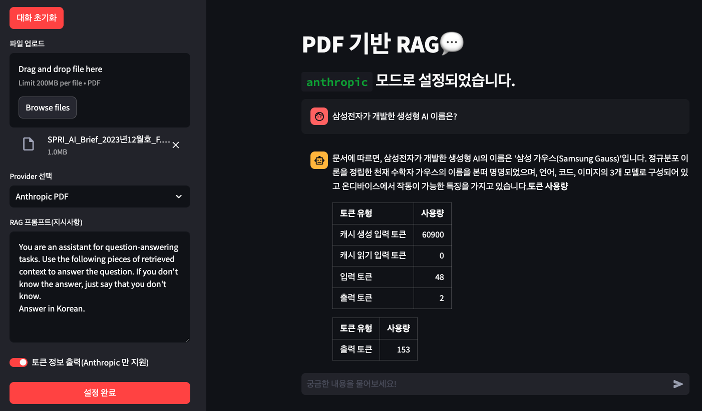

## EASY PDF RAG

OpenAI Assistant V2 와 Anthropic 의 PDF 기능을 기반으로 RAG 기능을 구현한 예제입니다.

> Anthropic PDF 기능 예시


> OpenAI Assistant V2 예시


### 설치

> poetry 사용(권장)
```bash
poetry shell
poetry update
```

> conda 사용
```bash
conda create -n easy-pdf-rag python=3.11
conda activate easy-pdf-rag
pip install -r requirements.txt
```

### 실습파일

**Jupyter Notebook**
- [OpenAI-Assistant-V2](https://github.com/teddylee777/easy-pdf-rag/blob/main/01-OpenAI-Assistant-V2.ipynb)
- [Anthropic-PDF](https://github.com/teddylee777/easy-pdf-rag/blob/main/02-Anthropic-PDF-Parsing.ipynb)

**Google Colab**
- [OpenAI-Assistant-V2](https://colab.research.google.com/github/teddylee777/easy-pdf-rag/blob/main/01-OpenAI-Assistant-V2.ipynb)
- [Anthropic-PDF](https://colab.research.google.com/github/teddylee777/easy-pdf-rag/blob/main/02-Anthropic-PDF-Parsing.ipynb)

### Streamlit 실행

```bash
streamlit run main.py
```
